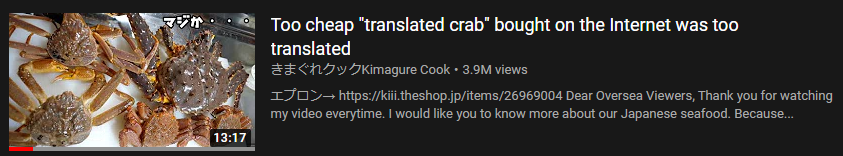
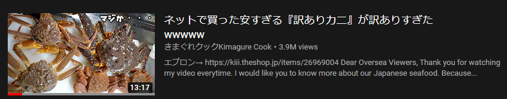

# YouTube Stop Translating

A userscript (Tampermonkey / Greasemonkey) that stops YouTube from translating video titles in foreign languages into your native language. 

## Example

Japanese video titles will no longer translate to Google Translated "English":

## How to Use

This is a two step process:

### Step 1 - Generate a YouTube API Key

1. Go to [Google Developer's Console API Library](https://console.developers.google.com/apis/library/youtube.googleapis.com?q=YoutubeData).

2. Create a new "Project". 

3. Set the Project Name to whatever you want but leave the location as "No organization".

4. Select "Add APIs & Services", search for "YouTube Data API v3", and click 
the "ENABLE" or "MANAGE" button.

5. Select the "Credentials" tab on the left.

6. Click on the "Create Credentials" button, followed by the "API key" option 
from the dropdown menu.

7. When it shows your API key, click on the "RESTRICT KEY" button.

8. Give the API key a name (ex. "YouTube Stop Translating").

9. Set "Application restrictions" to "HTTP referrers (web sites)", and click 
"ADD AN ITEM" three times to add these values:

    `https://www.youtube.com/`
    
    `https://youtube.com/*`
    
    `https://youtu.be/*`

10. Under "API Restrictions", select "Restrict key" and select 
"YouTube Data API v3" from the drop-down

11. Click "Save".

12. Click the copy icon next to the API key to copy it.

### Step 2 - Activate this Script

1. Add the browser extension / plugin ["Tampermonkey"](https://chrome.google.com/webstore/detail/tampermonkey/dhdgffkkebhmkfjojejmpbldmpobfkfo) (Chrome/Chromium/Edge)
or ["Greasemonkey"](https://addons.mozilla.org/en-US/firefox/addon/greasemonkey/) (Firefox) to your browser.

2. Open the plugin and select the option to create a "new userscript".

3. Copy the contents of the [YouTubeStopTranslating.user.js](YouTubeStopTranslating.user.js) file into the new usersrcipt.

4. Save the userscript.

5. Open YouTube and paste in your YouTube API key when prompted.

### Screenshots

For screenshots of the process, please see the [ORIGINAL README](ORIGINAL_README.md)

## Credit

Forked from [pcouy's "YouTubeAutotranslateCanceler"](https://github.com/pcouy/YoutubeAutotranslateCanceler) under the MIT license.